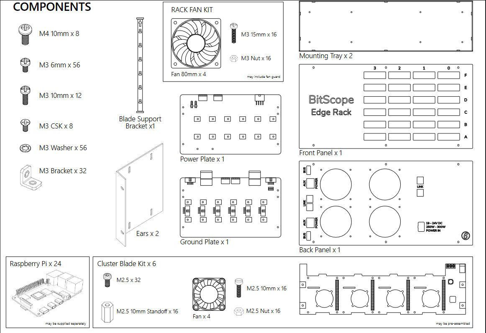
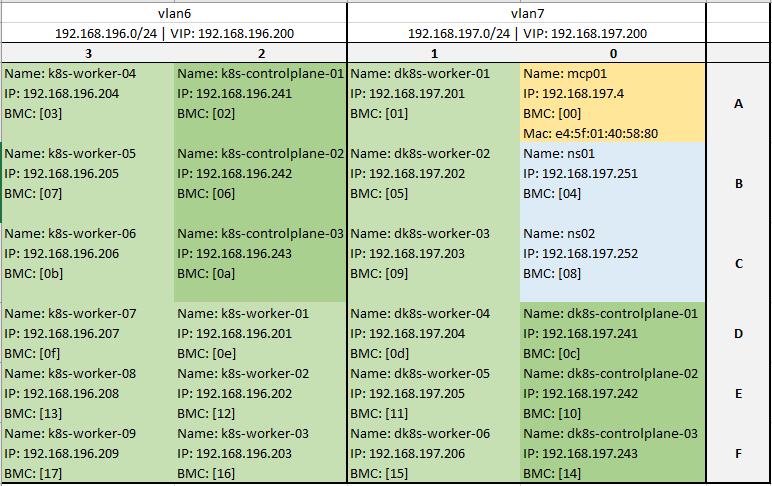
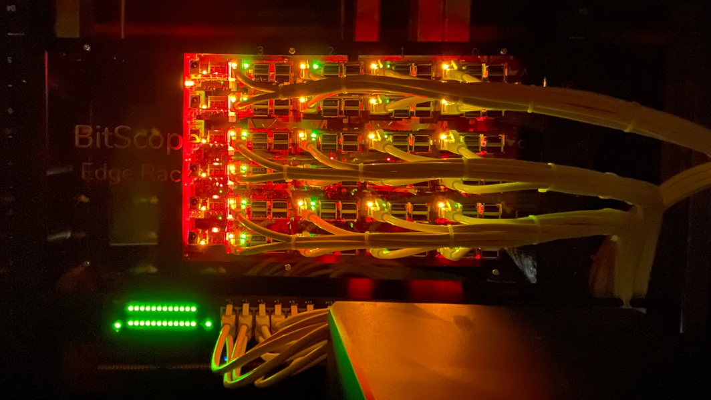
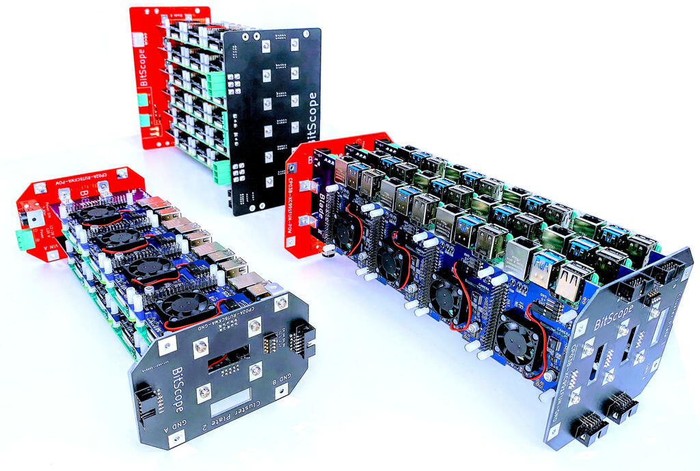

Here at the Dojo we spent a significant amount of time searching for a platform to base our home projects around. We needed a solution that would support multiple programs running automation, the home UI, plugging into IOT sensors, and more. Further, we knew we wanted to base the project around [Kubernetes](https://kubernetes.io/) on ARM (k8s) and needed a reliable way to manage the Raspberry Pi nodes underpinning the k8s cluster. For a time we even [built our own cluster](../../../projects/raspberry-pi/micronetes/index.md) using 3D-printed parts! While Kubernetes worked well enough in that cluster it was challenging to manage remotely. We couldn't even cycle the power on the individual nodes from our workstation. So the search for a better solution continued...

A few months passed and we came across [some posts](https://hardware.slashdot.org/story/17/11/25/051211/theres-a-cluster-of-750-raspberry-pis-at-los-alamos-national-lab) by [BitScope](http://www.bitscope.com) talking about large scale Raspberry Pi clusters. Imagine building a [750-node(!!) Raspberry Pi cluster](http://cluster.bitscope.com/blog/lanl-bitscope-raspberry-pi-cluster-press-release) for Los Alamos. We knew our search was nearing an end...

We reached out to BitScope and were given the opportunity to talk about our needs with BitScope's CEO, Bruce Tulloch. It goes without mention that Bruce is super knowledgeable and passionate about cluster computing and Raspberry Pis in general. Over the course of several exchanges, Bruce outlined a broad range of solutions; from a simple [4-node blade](http://my.bitscope.com/store/?p=view&i=item+4) all the way to the large clusters they did for Los Alamos (with built in cluster management). As much as we like to over-engineer things here at the Dojo there is a limit to what our collective spouses will let us get away with! We settled on [BitScope's 24-node ER24A Edge Rack](https://docs.bitscope.com/R8ZZ80UG/ER24A-T2QLSBJY-blvj7odwmxofvhqh.pdf). A note here: even the 4-node variation would run the home automation we're planning to do here at Geekdojo (assuming Raspberry Pi 4 with 8GB ram) so don't feel that you need the larger cluster if budget is a challenge.

For our purposes, the 24-nodes of the ER24A would provide us with the ability to run a development and production k8s cluster along with a few spare nodes for DNS, certificate management, and cluster management. It comes with the same [cluster management](https://docs.bitscope.com/cluster-blade/#lqnpc3sa9wxk3qc0) found in the larger clusters so each node can be accessed and controlled remotely including cycling the power and console access. BitScope offers the Edge Rack in both assembled and flat-packed versions. Never one to shy away from getting our hands dirty, we asked for the flat-pack version.

## Physical Assembly



The [assembly instructions](https://docs.bitscope.com/R8ZZ80UG/ER24A-T2QLSBJY-blvj7odwmxofvhqh.pdf) for the ER24A are clear and easy to follow. Total assembly time, at a leisurely pace, was just over three hours to go through all 16 steps. Most of that time is spent mounting each Raspberry Pi to its respective slot in the cluster blades. There are four Pis per blade and six blades for a total of 216 screws (counting the two mount screws on each side of each blade to affix it to the rack). The build quality is high and tolerances are pretty tight so we left the blade chassis screws a little loose until the very end and then tightened everything down in sequence. You'll need nimble fingers to get the SD cards into the Pis at the top so we recommend pre-flashing and installing all the SD cards before mounting the blades in the Edge Rack chassis.

There are four chassis fans to mount on the ER24A for cooling and they connect directly to the Raspberry Pis. There are also fans on each individual Raspberry Pi that are controllable via the cluster management system (called [Baseboard Management Controller](https://docs.bitscope.com/cluster-blade/#yiov7w5z9j7nt098) or "BMC"). Be sure to note the guidance in the assembly instructions to connect the chassis fans to Raspberry Pis on different blades to ensure cooling continues in the event of blade failure.

Power for the Edge Rack is handled by an external 300W 24-volt brick. BitScope can supply the power brick or it can be purchased from retailers residing in your country of residence (often the cheaper option if you're not in Australia). BitScope recommended options along the lines of [XP Power's VES300 Series](https://www.xppower.com/product/VES300-Series). One thing to note here is that the output connector must be a male Molex Mini Fit JR, 8 way, in order to connect to the power connector on the back of the Edge Rack. As evidenced on the last page of the instructions, it is possible to set the Edge Rack up with redundant power. We chose to hold that upgrade for a later write-up.

Edge Racks are designed to fit in a standard 19" rack and, given the small 5U size, the ER24A will do fine in our [two post Tripp Lite 13U rack](https://www.amazon.com/gp/product/B00NOTXZZG/ref=as_li_tl?ie=UTF8&tag=geekdojo-20&camp=1789&creative=9325&linkCode=as2&creativeASIN=B00NOTXZZG&linkId=62252b5af65d5998810e58cd064ff606) up in the attic. In pairing it up with a 1U [Netgear GS324T 24-port switch](https://www.amazon.com/gp/product/B07PHL1V2B/ref=as_li_tl?ie=UTF8&camp=1789&creative=9325&creativeASIN=B07PHL1V2B&linkCode=as2&tag=geekdojo-20&linkId=d94ded2d52fb273f0ca5a17044c67474), we consumed 6U worth of space on the rack. That leaves us with plenty of room for the other components in the system.

## 24 Compute Nodes

The ER24A accommodates Raspberry Pi 4B, 3B+, 3B, 2B or Zero nodes. For this exercise, we need to maximize both the CPU cores and RAM available to us. We therefore filled each blade with Raspberry Pi 4Bs with 8GB of RAM each. This gives us a total of 96 cores and 192GB of memory. We'll go into more detail on the Home UI project page but, in brief, we plan to host a 9 node development and 12 node production k8s cluster. One node will be reserved as the Edge Rack cluster master and 2 nodes will be used for DNS, certificates, and possibly as load balancers (TBD at the time of this writing). For now, we're running Ubuntu on all the nodes but that may change as we evolve our projects.

Now is probably a good time to mention the need to maintain tracking of the nodes. There are several identifiers that come in handy when working at the OS level on the nodes. DNS name and IP are handy but we found we also needed to track the BMC ID for each node to ensure we could quickly access them via the BMC when needed. If you purchase a pre-assembled Edge Rack then BitScope will provide you with a sheet containing the BMC ID and node mappings. Depending on need, having the MAC address and BMC UID may also be worthwhile. This can be seen in the image below and also delineates the two k8s clusters on vlan 7 (development) and vlan 6 (production).



## Network Considerations

Each implementation of an Edge Rack is likely to have unique networking constraints. For our specific use case, we wanted to be able to connect all 24 nodes to the same switch and still isolate the traffic. This meant we needed a 24-port switch with at least two extra SPF (think additional uplinks) ports to connect that switch to the main network and the NAS that the Kubernetes cluster will use. We chose the [Netgear GS324T 24-port switch](https://www.amazon.com/gp/product/B07PHL1V2B/ref=as_li_tl?ie=UTF8&camp=1789&creative=9325&creativeASIN=B07PHL1V2B&linkCode=as2&tag=geekdojo-20&linkId=d94ded2d52fb273f0ca5a17044c67474) since it provided full management capabilities allowing us to configure the previously mentioned VLANs. The GS324T also provides 2 SPF ports so we linked one to the primary backbone switch in the house and the second went directly to our [Synology DS918+ NAS](https://www.amazon.com/gp/product/B087Z34F3R/ref=as_li_tl?ie=UTF8&tag=geekdojo-20&camp=1789&creative=9325&linkCode=as2&creativeASIN=B087Z34F3R&linkId=4a48d29295920b30cf579c4557b35111) (Linking to the DS920+ since the 918 is no longer sold). The NAS is visible in the lower right of the below image. The configuration of the switch and NAS will be outlined in our Home UI setup article.



## Cluster Management Software

Interacting with the BitScope Baseboard Management Controller (BMC) is done through the serial bus. Due to [how the Raspberry Pis handle bluetooth and the serial mounts](https://docs.bitscope.com/pi-serial/#ports) this can be a challenge to get working. Since we are running Ubuntu we had to jump through a few more hoops to get everything working. Credit goes to [this StackOverflow](https://raspberrypi.stackexchange.com/questions/114366/rpi4-serial-port-not-working-on-either-raspberry-os-or-ubuntu) for helping us work through that challenge!

Now that we had ```/dev/serial0``` up and running we could start looking at the nodes:

```bash

# connect to the serial port
> screen /dev/serial0 115200

# upon the first use we need to "unlock" the BMC on the master node
> UnLockMe

# let's query the node for general status
> =
   00 00 1 1d 74

```

The equal sign above asks the BMC to report the [status](https://docs.bitscope.com/control-plane/#mpwr78v15hk8qkrn) for the node the BMC is connected to. If this is your first time connecting then it would be the master node as evidenced by the second "00" above. The response above says the node:

- ID is "00",
- is the master node (the second "00"),
- power state is enabled,
- is drawing current as defined [here](https://docs.bitscope.com/control-plane/#1ya61gys8ewmge6m),
- has a fan speed of 74 as defined [here](https://docs.bitscope.com/control-plane/#pontz4r1xqgqvw5s).

Should we want to connect to another node we enter the ``|`` command as follows:

```bash

# assuming already connected to serial0
# enter the BMC ID followed by the pipe
> [09]|

# if we then enter = we get the status of the new node
# "ff" in this instance means slave node
> =
   09 ff 1 1b 6c

# we can see the BMC UID with the hash command
> #
   ad96a737-3886-4b73-87af-b0c205e984a0

# ctrl-G will return us to the master

```

Should we want to [power off the node](https://docs.bitscope.com/control-plane/#fdwy59g4zlqam2t8) we would simply enter ``\`` and ``/`` for powering it back on. A word of caution here, this command immediately shuts off power to the node which, in general, is not healthy for modern operating systems. The BMC provides a [method for accessing the console](https://docs.bitscope.com/control-plane/#61g08htstvg5j3vz) and it is strongly recommended to use the operating system's native ``shutdown`` command whenever possible. In addition to the console, the BitScope I/O System provides [modules](https://docs.bitscope.com/cluster-blade/#lqnpc3sa9wxk3qc0) for status, power management, system monitoring, fan control, a 'mailbox', SRAM control, EEPROM configuration management, and calibration. Most of these are outside the scope of our use case but become important as the Edge Rack is configured for specific cluster computing use cases. We have to admit though - being able to fully control each node from halfway across the house is super helpful when something goes awry with the cluster.

## Conclusions

The BitScope team has definitely put their homework into the Edge Rack. The physical construction is well laid out, with good tolerances, and straight-forward assembly. The components used throughout are high-quality and industrial grade; none of the connectors wiggle, the circuit boards all line up, and the blades are securely bolted together. The chassis holds everything firmly to the 19" rack. The fans on each Pi and the four chassis fans keep everything cool with surprisingly little noise. The blue plexiglass front is well cut and provides a finished and immediately recognizable look to the front of the rack.

BitScope's documentation game is very strong with every conceivable aspect, physical or logical, clearly described. There are plenty of tips and tricks throughout that help in any potential trouble spots.

From a cluster software perspective, the syntax was easy to pick up and intuitive to use. We love the ability to control each node remotely. The ability to pull statistics from each node on current draw, fan speed, and power gives us a fantastic idea for a future "core" UI in the Home UI project we're starting on. Think futuristic "core health" UI moving to the pulse of each node.

If you need a reliable way to power and control more than a couple Raspberry Pis or want to start a Kubernetes@Home project, we strongly recommend having a look at BitScope's Edge Rack and Cluster Blade offering. The Racks are available in 4, 8, 12, 24, 48, and 96 node offerings. Finally, the BitScope team is a pleasure to work with and a great source of knowledge where Raspberry Pis are concerned. They are there for you if you need assistance but more than likely you won't!


