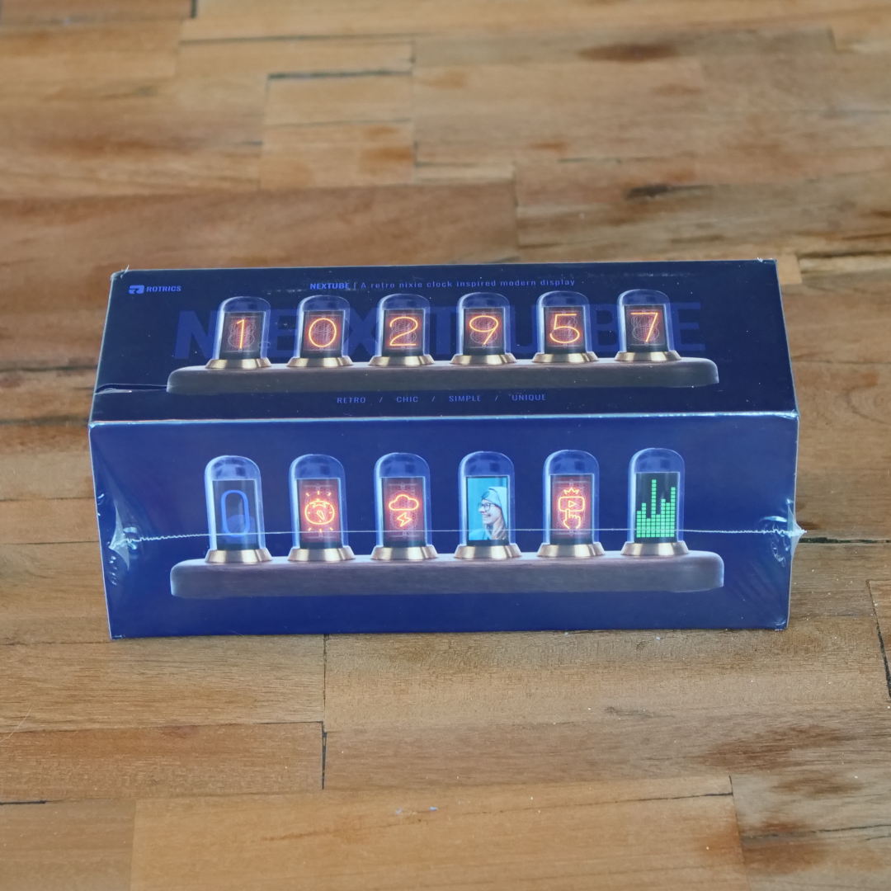
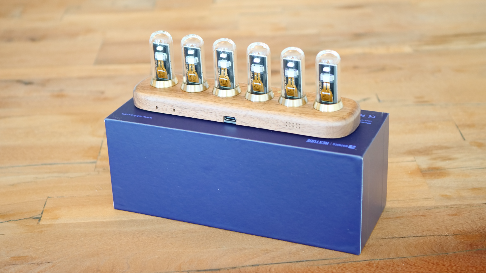
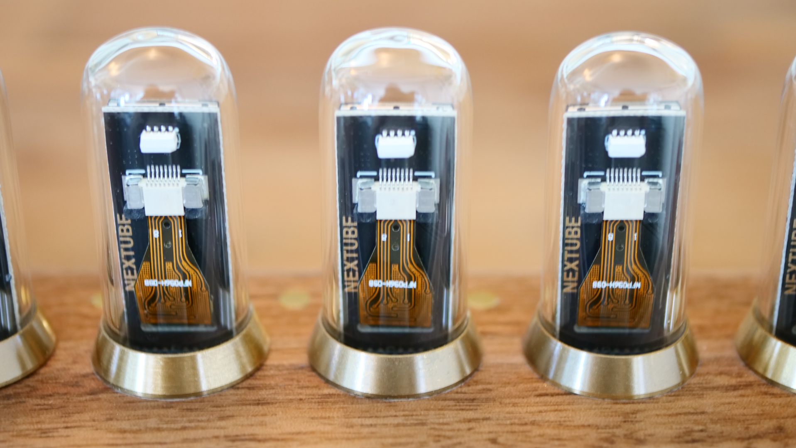
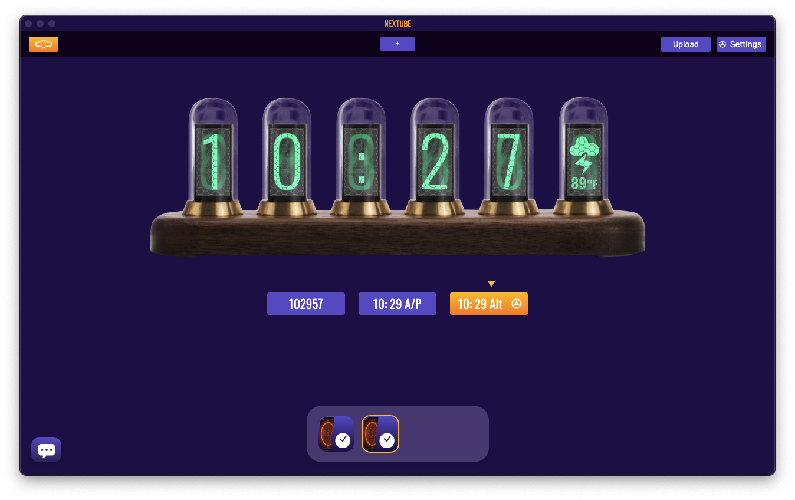
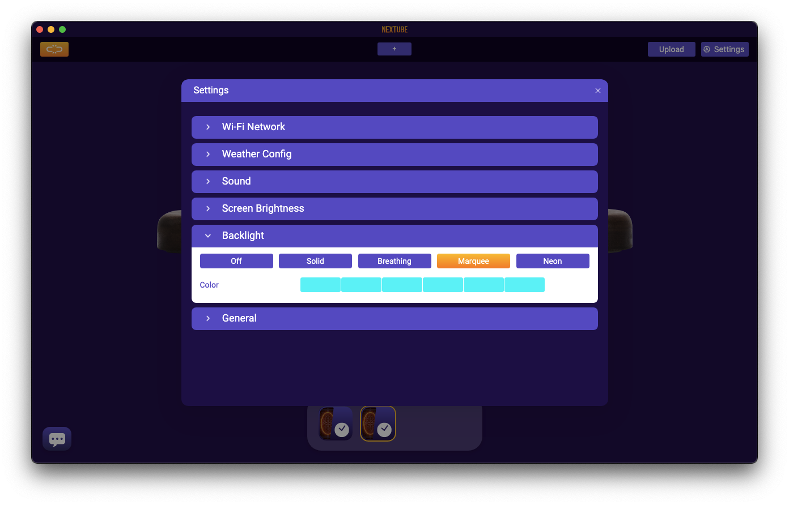
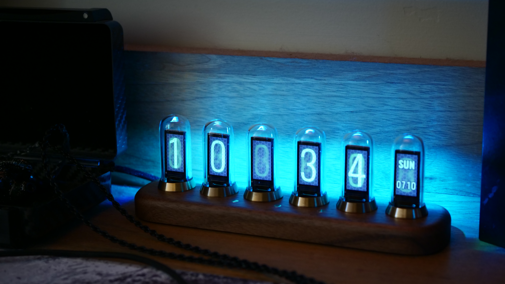

# Nextube Nixie Inspired Clock

Does anyone not like eyeballing nixie tubes?? We're pretty sure that's the exact thought that went through our heads in August 2021 when [Rotrics](https://rotrics.com) launched their nixie tube inspired clock on [Kickstarter](https://www.kickstarter.com/projects/rotrics/nextube-a-retro-nixie-clock-inspired-modern-display). Rotric's version uses IPS screens to recreate the same nostalgic look while allowing for some extensive customizations. After [many, many, pandemic related delays](https://www.kickstarter.com/projects/rotrics/nextube-a-retro-nixie-clock-inspired-modern-display/posts) we finally received the hardware yesterday (about a year later). Kudos to Rotric for persevering through all the chip shortages, factory shutdowns, and other covid related shenanigans. The final product looks to be worth the wait with a pretty high-quality build-out.

## Unpacking the Nextube

There's not a whole lot to talk about in terms of unpacking the Nextube. It's a simple affair with literally three parts: the Nextube itself, a USB power supply, and a USB Type B to Type C cable. The foam packing is very good and kept everything firmly in place during transit. One thing many folks have commented on are the absolute, complete, lack of any instructions what-so-ever... There's not even a QR code for Rotric's website. This can leave users scrambling a bit to figure out how to setup the clock. It does turn on out-of-the-box but, unless you're in Central time it is probably not going to be showing the correct time (or date for that matter). To that end, here are some of the most pertinent links. The Facebook group is, at the time of this writing, the most active with some solid help available.

- [Nextube Installer](https://rotrics.com/pages/downloads)
- [Facebook Support Group](https://www.facebook.com/groups/197056519103446)
- [Rotric Discord Server](https://discord.gg/NWh6f36)
- [Rotric Community Forums](https://community.rotrics.com/)

## Overall Thoughts

The Nextube has good solid construction. All the parts fit tightly and the tolerances between the wood, brass, and glass tubes is tight. The walnut is sanded and finished well and prominently shows off the wood grain. The millwork for the three brass buttons is clean with a nice flush mount. Electronically the Nextube is built well with the PC boards and screens within the tubes being cleanly cut and traced. The USB connector is firm and presents a solid anchor point for the cable to attach to. Overall, Rotric appears to have done an excellent job working with the factory to bring their A-game to the construction.

## Connecting Nextube

For the installation here we wanted to keep with our general philosophy of attaching items like this to the Mac Mini we have driving the [Stream Deck](../../setups/geekdojo/streamdeck-kvm/index.md) and other accessories. This does limit some functionality since we can't drive the audio from the gaming PC (for example) but it keeps everything nice and tidy and out of the way or the workhorses. Given that we installed Nextube Studio on the Mac Mini and *then* connected the Nextube to the USB on the Mini. Upon opening the app, we can connect to the Nextube by clicking the orange button in the top left corner and selecting "/dev/tty.usbserial-14340". Obviously, your setup my vary. Likewise, since the network here is pretty locked down we didn't want to deal with trying to connect to the Nextube over Wifi.

Once connected, the colors, apps, cities, and other settings can be changed via the "Settings" button in the top-right corner. Settings auto-save locally but you *must* click the "Upload" button to push them to the Nextube. The upload process is pretty slow but not enough to warrant more than a mention. **One catch here**; it appears that the clock and date will not update via the original profile (app?). So click the "+" button right in the middle of the top bar and re-add a "Clock" then upload. That should force the Nextube to pickup the date and time from the computer you are pushing from.

We color matched the tubes and backlight (marquee) to the gaming workstation's RGB lighting scheme.

## Conclusions

Overall, the Nextube definitely scratches that nixie tube itch. It looks just retro enough sitting on the desktop while still being configurable enough to match it to the rest of the desktop elements. The physical construction is superb. The software is a little bit clunky to use but straightforward once you learn the quirks. Overall, we give the Nextube high marks for a Kickstarter project. The Rotric team did an excellent job of communication throughout a difficult period and delivered a pretty decent product.

Although the Kickstarter has now closed, Rotric is offering the Nextube via their [online store](https://rotrics.com/products/nextube).
