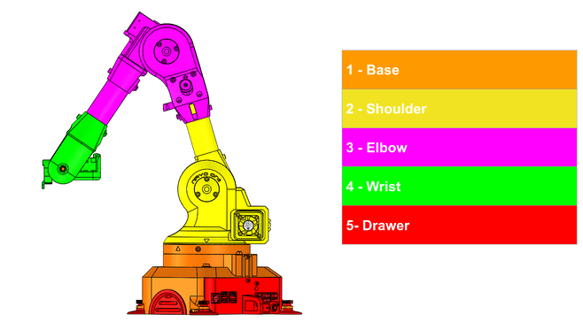

# Review: Niryo 6-axis Robotic Arm

In Act 2 of the first Iron Man we see Tony Stark (played by Robert Downey Jr.) building out the first incarnation of Iron Man armor. During one of his initial flight tests Tony can be seen arguing with one of his trusty companions - a robotic arm. This robotic arm makes repeated appearances throughout the films helping Tony with assembling his creations; often to great comic relief. Combine that pop culture impression with a general love of robotics and one can imagine our excitement when [Niryo](https://niryo.com) released the first incarnation of their six-axis arm based on the Raspberry Pi platform the [Niryo One](https://niryo.com/product/niryo-one/). 

The Niryo One lived up to our expectations and provided a surprising thorough learning experience around both mechanical and digital design decisions inherent to robotics operating at this level. That is, perhaps, unsurprising given Niryo's stated focus on educational applications. If you are looking for a project to teach about mechanical leverage including 3D-printed design and stress modeling/considerations then the Niryo One is a great platform. Likewise, Niryo Studio and the well-documented python libraries can teach young and old alike about programming in 6 degrees. While the Raspberry Pi might not be capable of Tony Stark level AI it readily supports designing complex movements with the Niryo One.

## Assembling the Niryo One

Assembly, at a leisurely pace, took maybe 8 hours with every [step clearly identified](https://niryo.com/docs/niryo-one/) in Niryo's documentation. As evidenced in the image above, the entire assembly process is broken down into 5 separate sections. If the reader has ever assembled even remotely complicated lego projects then assembling the Niryo One should be relatively straight-forward. Likewise, each step has an accompanying video to follow along to. Users can stop, start, and replay at their leisure. The image below will take you to Niryo's YouTube channel and the first video in the Niryo One series.

Should the reader be interested in building the Niryo One from scratch, the physical product is licensed under Creative Commons. The STLs are available on [Niryo One's GitHub](https://github.com/NiryoRobotics/niryo_one). Likewise, the [Niryo One ROS](https://github.com/NiryoRobotics/niryo_one_ros) is available under GPLv3. We forked both repositories into [geekdojo's GitHub organization](https://github.com/geekdojo-ofc) and utilized them from there.

## Working with the Niryo One

The easiest way to start working with the Niryo is through their learning mode in the Niryo One Studio. This software allows the user to physically position the arms of the robot in order to record the movement. The software will then replay that movement back transitioning between the different stages. The image below will take the reader to the YouTube video demonstrating this functionality.

### ROS

For those not familiar with ROS, it is an open source [Robot Operating System (ROS)](https://www.ros.org/) and is [fully supported](https://github.com/NiryoRobotics/niryo_one_ros) by the Niryo One. For readers looking to get all the way down in the weeds with the Niryo One we highly recommend going this route as the interfaces are well defined and can abstract away some of the more mundane movements. If the reader really wants to get their hands dirty they can send commands directly to the Niryo One using [Python](https://drive.google.com/uc?export=download&id=1kLvj120O1UYl_6VXX617K7ZnF6LGDTEf) or C++.

## Conclusions

Whether the user is a Tony Stark fan, a hobbyist or a student wanting to get a taste of coding robotic arms for a future career we strongly recommend the Niryo One. There is a lot to be learned in the simple assembly of the arm: how leverage works, what needs to be greased, wire routing, stress points, etc. If the user does not have any programming experience the Niryo One Studio provides an easy to understand and use interface. Using the Niryo One to learn programming is probably a bit to steep but the user already understands Python then the Niryo One is an excellent platform to sharpen those skills and expand into robotic movement.