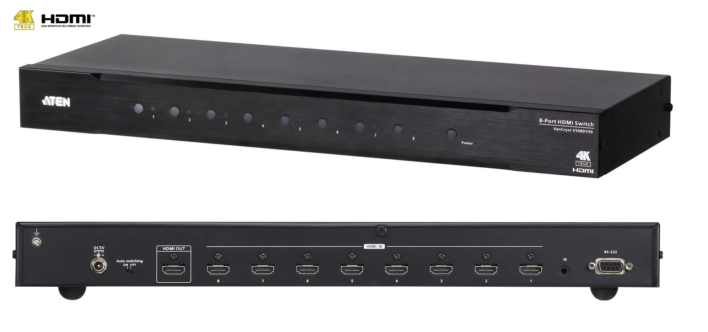
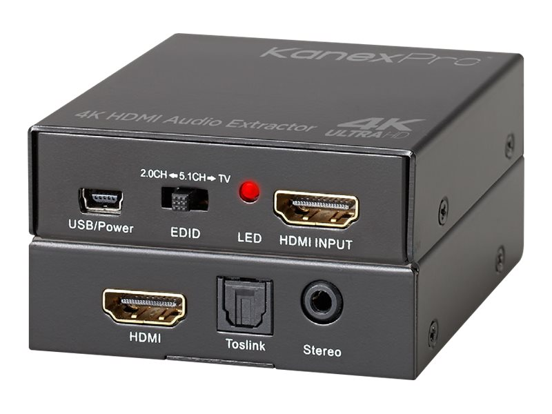
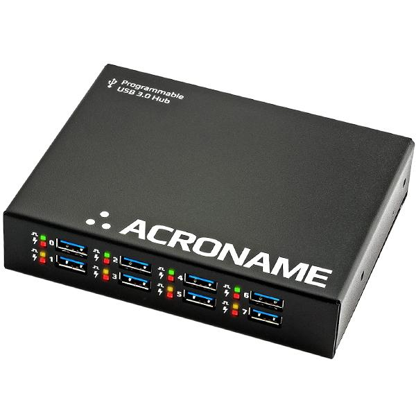
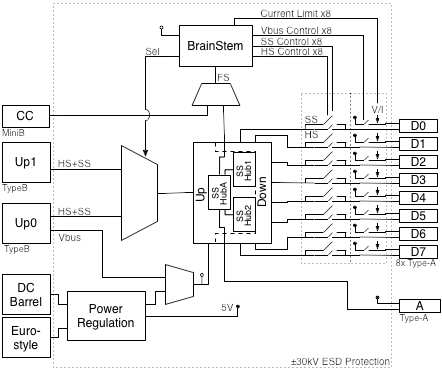
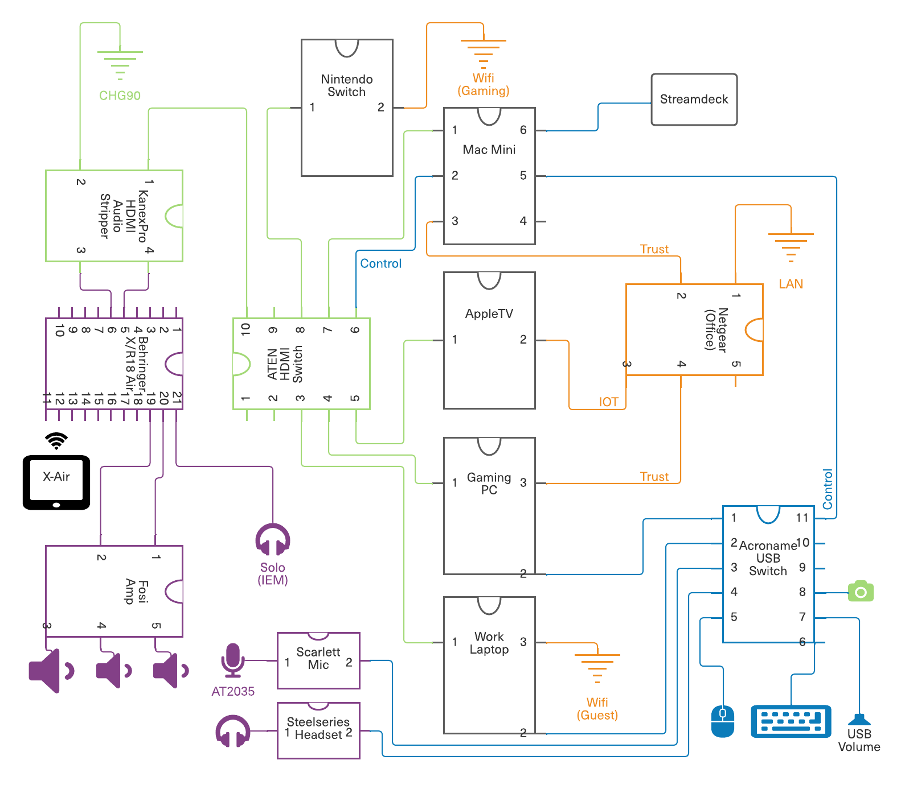
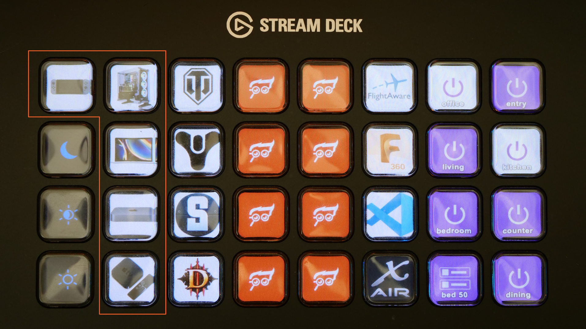
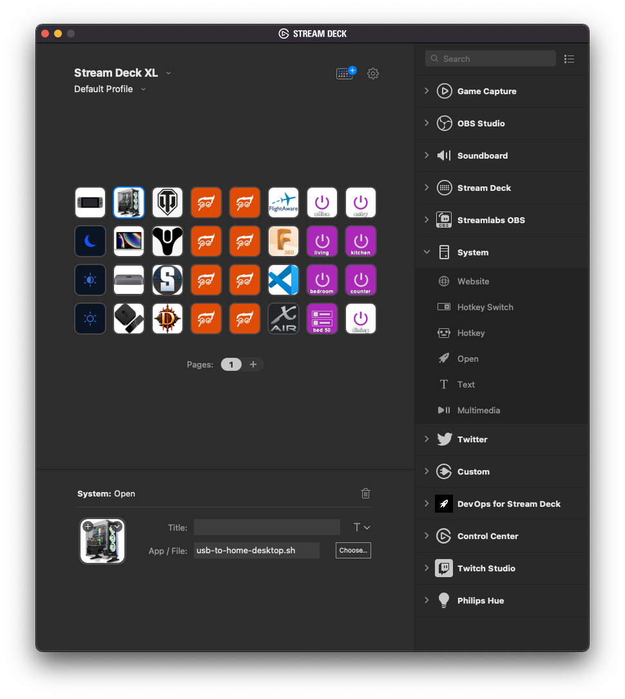

# Stream Deck KVM for Work and Home

Like many IT workers I transitioned to full time working from home during the Covid pandemic. This presented an interesting challenge in terms of space utilization. Our place here in San Diego is an 875 sq. ft. one-bedroom condo with two adults and two pets - not the most spacious place on the planet. There isn't enough room to have more than one spot for work. Further, I had just purchased Samsung's gorgeous 49" curved display (the [CHG90](https://www.samsung.com/us/computing/monitors/gaming/49--chg90-qled-gaming-monitor-lc49hg90dmnxza/?cid=sem-mktg-pfs-mon-us-google-na-06012022-190128-&ds_e=GOOGLE-cr:0-pl:301662614-&ds_c=FF~GMG-Specific+Models_CN~Monitors_PH~on_MK~usnat_BS~vd_PR~mon_SB~gamm_FS~lo_CA~kew_KS~ba_MT~exact-&ds_ag=AG~chg90_MK~usnat_AT~ta_MD~h_PK~roah_PB~google_AI~no_TG~mas_SA~na-&ds_k=samsung+chg90&gclid=CjwKCAjw5NqVBhAjEiwAeCa97eeV5PUPFUobw-3AqOPFOA5gRV7vgfrK-KKgO4_VWq6NtzGB8tg6GBoCEa0QAvD_BwE&gclsrc=aw.ds) - arguably one of the best purchases I've ever made) and I really wanted to be able to use the monitor and my normal keyboard/mouse on both my work laptop and my gaming rig. There was an added bonus here if I could figure out how to tie-in the Nintendo Switch, Apple TV, and Mac Mini into the same system.

I entertained purchasing a normal Keyboard/Video/Mouse (KVM) switch but we all know that's not really how we do things around here! It must be over-engineered! After studying the problem for a bit, it appeared that it would be fairly straight-forward to create our own leveraging [Elgato's Stream Deck](https://www.elgato.com/en/stream-deck) as the "switch" part of the system. The Stream Deck would drive separate, programmable, HDMI and USB switches via Python calls to each device. At the time, I had not yet purchased any audio switching equipment so we also needed to figure out how to get the audio off the HDMI channels and sent over to the desktop audio system.

## Bill of Materials

After some more internet sleuthing I settled on the following components; all of which are, as usual, complete overkill...

### Programmable HDMI Switch



As I dug into the video switching problem it became apparent that it would be prudent to future proof a little bit here and provide support for 4k (even though the CHG90 is only standard 1080p). The switch also needed to support HDMI 2.0 and HDCP 2.2 as both of these technologies would be important as we upgraded video and audio components over time. We were going to plug in 5 devices to start so the device would need to support that many inputs at a minimum. Lastly, don't forget that it needed to be *programmable* either through LAN, RS-232, or USB interface.

I'm generally a fan of ATEN components and found what I needed pretty quickly in the [ATEN VS0801HB](https://www.aten.com/global/en/products/professional-audiovideo/video-switches/vs0801hb/). The ATEN VS0801HB supports video resolutions up to True 4K (4096 x 2160 @ 60Hz 4:4:4), data rates up to 18 Gbps, 3D, Deep Color up to 12-bit, and HD lossless audio formats. It also supports multiple  control options include front panel push buttons, bi-directional RS-232, IR, and auto switch, allowing for easy integration. The Aten retails for $303 which is pretty reasonable given the 4k support and robust RS-232 interface. The push buttons on the front have come in handy when I've screwed something up and the switching automation dies.

### Audio De-embedder



With no other device in the mix I needed to strip the audio from the HDMI signal and send that over to the 2.1 amp and speakers. At the time, this eliminated the need to purchase an external audio switcher (something we did add to the setup later). This took a little more digging and some review reading to make sure the quality was there. I settled on the KanexPro HAECOAX2. The KanexPro HAECOAX2 is a 4K compliant audio de-embedder that extracts the audio from HDMI signal and provides outputs for analog stereo using 3.5mm headphone jack and digital TOSLINK audio. The KanexPro is fully HDCP compliant and supports up to 16-bits per color so we shouldn't see any degradation in the HDMI signal.

**One comment about stability:** every once in a blue moon the KanexPro seems to lose its little mind and switching results in a black screen. It appears that the HDMI handshake fails. The only method I've found to get it back is to power cycle the device. It is a rare enough occurrence that I haven't bothered trying to replace it.

### Programmable USB Hub



The final piece of the puzzle involves switching the USB devices between the work laptop and gaming rig. I was worried about switching USB to the Mac mini since I use VNC Viewer to access it and of course the Apple TV and Nintendo Switch don't have that use case. Back to Google and *much* more searching I found [Acronome's line of programmable USB hubs](https://acroname.com/store/programmable-industrial-hub-s79-usbhub-3p?gclid=CjwKCAjw5NqVBhAjEiwAeCa97ZV9ndzPBxYX6b8Ue-qkOo6Mm7UXKGwwTNjFyYdTMLfdM491BRaGgxoCZoQQAvD_BwE). These hubs are industrial grade and super pricey ($825!!) but they fit the bill *exactly*. The work laptop and gaming rig plug into separate TypeB USB ports on the back, the Mac Mini (where the Stream Deck resides) plugs into the MiniB control port, and there are 8 TypeA ports on the front for all the devices (diagram below). There is also a [development kit](https://acroname.com/software/brainstem-development-kit) available using Acronome's "BrainStem" technology - exactly what we needed to interface with the hub.



## Connecting all the Things

A picture is worth a thousand words. The key takeaway from the above diagram are the green (HDMI) and blue (USB) connections. For example the Mac Mini has both a blue line (the USB control) and a green line (HDMI video output) going to the HDMI switch. All peripherals, my work laptop, and gaming rig plug into the Acroname USB switch. The KanexPro peels off the audio channels from the HDMI signal and originally sent them directly to the Fosi 2.1 amp. I've since added a Behringer X/R18 Air to that mix but we'll talk about that in a separate article.



## Bringing Everything Together

If you're not already familiar with [Elgato's Stream Deck](https://www.elgato.com/en/stream-deck), I highly recommend taking a moment to browse through their site and familiarize yourself with the possibilities of this little breakout hit with the streaming community. The Stream Deck is a programmable push button array with LCD screens for button caps. As evidenced in the image below it is fully customizable both in terms of button images and what happens underneath. You can even create custom keys using [Elgato's Key Creator](https://www.elgato.com/en/keycreator). For this exercise, we're using the most basic function which allows a shell command to be run whenever a button is pushed. The 5 buttons associated with the KVM are outlined above.



This is accomplished in the Stream Deck Editor and boils down to wrapping whatever code is being executed in a shell command that runs it. This show in the screenshot below where I selected the button for my gaming rig and entered in the [shell script](https://github.com/geekdojo-ofc/streamdeck/blob/main/usb-to-home-desktop.sh) to run. That shell script wraps a [python script](https://github.com/geekdojo-ofc/streamdeck/blob/main/usb-to-home-desktop.py) that switches the USB hub first via the USB control port and then calls out the RS-232 serial connection to the ATEN and tells it to switch to port 7 (the workstation's port).

```bash
# Copyright (c) 2018 Acroname Inc. - All Rights Reserved
#
# This file is part of the BrainStem development package.
# See file LICENSE or go to https://acroname.com/software/brainstem-development-kit for full license details.
import serial
import brainstem
#for easy access to error constants
from brainstem.result import Result
import time

# Create USBHub2x4 object and connecting to the first module found
print ('\nCreating USBHub3+ stem and connecting to first module found')
stem = brainstem.stem.USBHub3p()

#Locate and connect to the first object you find on USB
#Easy way: 1=USB, 2=TCPIP
result = stem.discoverAndConnect(brainstem.link.Spec.USB)
#Locate and connect to a specific module (replace you with Your Serial Number (hex))
#result = stem.discoverAndConnect(brainstem.link.Spec.USB, 0x66F4859B)

#Check error
if result == (Result.NO_ERROR):
    stem.usb.setUpstreamMode(0)
    print ('Set USB to home desktop.')
else:
    print ('Could not find a module.\n')

#Disconnect from device.
stem.disconnect()


#Now flip the ATEN to port 7 - the workstation's port
ser = serial.Serial('/dev/cu.usbserial-14340',timeout=1,baudrate=19200)
ser.write('sw i07\n')
ser.close()

```



All the built-in functions that are also available in the editor can be viewed on the right. For instance, all the Phillips Hue controls are ready out of the box. The 8 buttons on the right control all the lights in the condo here. I created five scripts and customized them for each button. It could probably all be done with a single script and parameters but sometimes simple is more maintainable over the long term.

## Wrapping it up

Once I had all the components researched and purchased the total assembly time was maybe an afternoon (4 hours(ish)). I burned a little bit of time figuring out how BrainStem works with the Acroname switch but it was fairly straightforward. For the most part the system works very well. I mentioned the rare black screen switching problem on the KanexPro side and there is also one concern on the USB side: everything seems to work fine except for my Logitech BRIO webcam. 80% of the time, the webcam does not successfully switch to the laptop or gaming rig. I have to unplug/plug the webcam to get it working again. There is the ability, with the Acroname Hub, to flip power on and off when switching ports. I may try and do that to see if that cleans up the problem. Beyond those two issues everything else works smoothly with all other devices seamlessly switching on command.

This is certainly over-engineering the heck out of a KVM but it was a lot of fun to pull the various technologies together and then create a cohesive system. If you'd like to try this at home and have any questions feel free to hit me up in the [Issues](https://github.com/geekdojo-ofc/streamdeck/issues) of the Stream Deck repo on GitHub.
