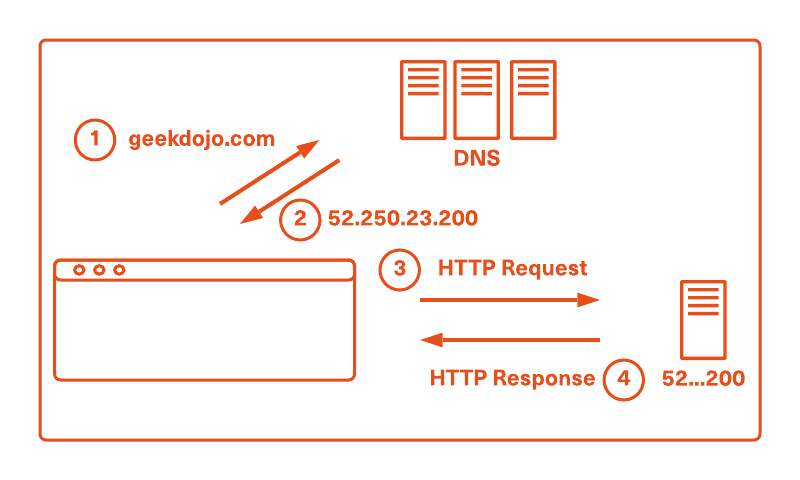

# How Does the Internet Work?

When you browse to a website via your web browser the content may travel as light through a fiber optic cable, it may exist as bits in copper, or even radio waves in the air. The path the data takes to get to your screen is suprisingly varied yet only take milliseconds to travel around the world. The process may seem complex but it is all based around a technology created in the 1970s, TCP/IP.

## Browsing to a Website

When a person enters "geekdojo.com" into a browser's address bar and presses the enter key a number of events occur:

1. The browser performs a DNS lookup on the website *host* name ("geekdojo.com" in this instance).
1. The DNS request returns an *IP* that the browser sends a request for the HTML web page to.
1. The server behind the IP returns a response containing the HTML web page content.
1. The browser reads the HTML page and makes further requests based on the content within the web page. These include scripts, more HTML, images, and data from the server or servers.
1. Once sufficient content has been returned to render the web page, the browser begins to do so.

As one might imagine, a number of networking technologies are at play here:

- DNS translates human readable *domains* (e.g. geekdojo.com) to machine readable *IPs*.
- The *TCP protocol* is used to route the traffic over the internet and on the proper *port*.
- The *HTTP protocol* is used to send requests to a server and receive responses from said server.
- If the browser is using HTTPS, then an encryption technology known as TLS (formerly SSL) is used to securely encrypt the traffic.

## Deconstructing a Web Address

To further illustrate how a website address works we can deconstruct the various parts of the geekdojo URL:

The *protocol* in this case is `HTTP` using `TLS` to encrypt the contents (the "S" in HTTPS). The *domain name* is `geekdojo.com`. The *TCP port* is `443` and the path to request from the server is `index.html`. Please note that we do not usually need to specify the port or the index page path. This is because the browser will infer a port of 443 for HTTPS (and a port of 80 for HTTP). Likewise, the default document (i.e. index.html) is set by the web server. The web server will look for that default document if no path is provided.

## Further Reading

There are, of course, a great many more things happening during this process to ship the data from the browser to a company's servers and back again. To add to your knowledge please continue to read through the [Dojo Networking content](index.yml). If you see any omissions, have questions, or would like to add more content please use the *Feedback* link at the top of each page.