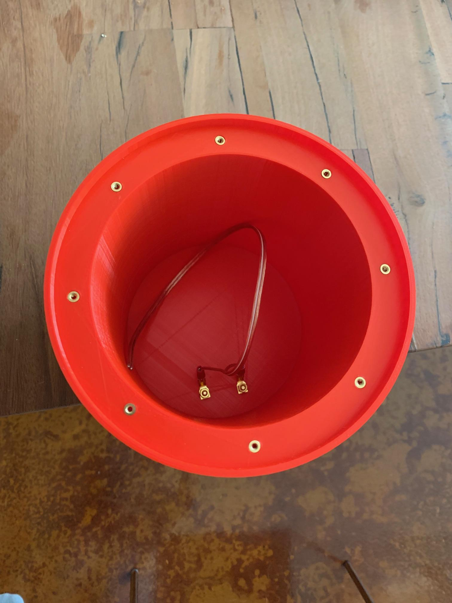

A while back I found it was time to upgrade the external speakers on my desktop. I'd always wanted to assemble my own setup and since I had just purchased an Ultimaker 2+ Extended I finally had enough print area to make it happen. I wanted sound that could rival bookshelf systems in the $1,000 - $2,000 range. To that end, I invested around $600 in the speakers and amplifier and am super happy with the result. The system handles both music and video games very well bringing snappy bass to machine gun fire and clear deep sound to Adele's *Rolling in the Deep*.

## Key Components

| Product | Description | Cost |
|---------|-------------|------|
| [Morel Tempo Ultra 402](https://www.crutchfield.com/p_210TU402N2/Morel-Tempo-Ultra-Integra-402-MKII.html) | 4" Coaxials. 80w RMS, 80-22,000Hz, 4ohm | $289 pair |
| [JL Audio 6W3v3-4](https://www.crutchfield.com/p_1366W3V34/JL-Audio-6W3v3-4.html) | 6" Subwoofer, 150w RMS, 30-300Hz, 4ohm | $230 each |
| [Fosi TB20A](https://fosiaudio.com/products/tb20a-tpa3116d2-stereo-amplifier-2-1-channel-class-d-audio-amp-with-subwoofer-volume-control-2x50w-1x100w-sub-output-super-bass-power-receiver-treble-bass-independent-adjustment-power-supply) | 2.1 Class D Amplifier, 50w x 2, 100w x 1 | $77 each |

**Total Assembly Time:** Around 200 hours due to long print times on speaker enclosures. Assembling each speaker after printing takes 1-2 hours.

## Morel Tempo Ultra 4" Coaxial Egg Speakers

This project was completed pre-geekdojo but including it here as it completes the 2.1 desktop set. The pair are based on [dr_frost_dk's](https://www.thingiverse.com/dr_frost_dk/designs) for [Egg Speakers](https://www.thingiverse.com/thing:2896301) on [Thingiverse](https://www.thingiverse.com). I found the designs were a perfect match for a set of [Morel Tempo Ultra 402's](https://www.crutchfield.com/p_210TU402N2/Morel-Tempo-Ultra-Integra-402-MKII.html) that I had. Yes, these are car speakers. Yes, they will do just fine in a home stereo environment on a home amplifier (assuming the amplifier can handle the 4ohm speaker impedance).

**Note:** it looks like dr_frost_dk (thumbs up for the World of Warcraft Frost Deathknight) has created a [newer design](https://www.thingiverse.com/thing:4665770) for the 4" set.

**Total Assembly Time:** around 150 hours due to the long print time (up to 70 hours for each speaker).

### Printing the Speakers

I printed these designs on my Ultimaker 2+ Extended using dr_frost_dk's recommended settings (repasted below for convenance). It took several tries to get the bed right and I ended up having to tweak the first pass to go slower and double thickness to keep it from warping on the bed. If you have a printer that can do dual filament I highly recommend using a support filament that is easily removed. The 2+ is single filament and the quality suffered while cleaning up all the supports. Fortunately, that's all on the bottom so it's not readily visible when they are sitting on the desktop.

#### Print Settings

| Setting | Recommendation |
|---------|----------------|
| Rafts: | No |
| Supports: | Yes |
| Resolution: | 0.2 |
| Infill: | 10 |

#### Cura Settings

| Setting | Recommendation |
|---------|----------------|
| Wall thickness: | 1.8mm (3 walls of 0.6mm nozzle) |
| Z seam behind speaker | (i use X 195 & Y 350 as my Build plate is X:390,Y:350) |
| Infill Pattern: | Grid |
| Support: | i use 0.4mm line width for support with 0.6mm nozzle) |
| Overhang Angle: | 66 |
| Pattern: | Grid |
| Line Distance: | 5 |
| X/Y Distance: | 1.2 |
| Gradual Support Infill Steps: | 4 |
| Gradual Support Infill Steps Height: | 3mm |
| Enable Support: | Roof & Floor |
| Support Interface Pattern: | Concentric |

### Assembly

Once the speakers were printed I used the same methods as the Subwoofer (grommets heated up on a soldering iron) to provide an anchor for the speaker screws. I also filled the void with the same batting from the Subwoofer. In my opinion the sound is a little more "full" with the batting in. That is, however, just my opinion - make your own choice. Based on a few comments on the prints I also added some quarter-inch think foam squares to the inside of the tubes. You can see them in the pictures as a darker area. This was due to a resonance coming from them at higher volumes. I note, in dr_frost_dk's recent updates that he added an extra support for the tube which may negate this need.

### Sound

Overall, I'm super happy with these. They produce a nice, clear, full sound without being to bright. They work equally well for music and video games. They pair very nicely with the JLAudio 6" Subwoofer when run on the [Fosi 2.1 Amplifier](https://fosiaudio.com/products/tb20a-tpa3116d2-stereo-amplifier-2-1-channel-class-d-audio-amp-with-subwoofer-volume-control-2x50w-1x100w-sub-output-super-bass-power-receiver-treble-bass-independent-adjustment-power-supply) at 50 watts per channel. One note there, I do run the crossover at the highest frequency to keep the lows out of the Morels. Since the Subwoofer is sealed it handles the higher frequencies just fine (at the expense of some low end of course).

## JL Audio 6w3v3-4 (or -8) Bass Tube

This repository contains STL files for 3d-printing a 6.5" bass tube tuned to 35Hz. The tube is a sealed design providing quick response time with enough low end to keep up with home theater or video game demands. Gun fire provides plenty of punch and explosions roll off the tube shaking your seat.

### Files

- [BassTube.stl](media/designs/BassTube.stl): The bass tube itself
- [Grill.stl](media/designs/Grill.stl): The Grill for the front of the tube. Entirely optional depending on preference and need. If the tube is somewhere the vacuum cleaner can whack it I highly recommend the grill.
- [Mount.stl](media/designs/Mount.stl): The floor mount for the tube - print two of them.

### Materials

- ~700g PLA Filament (bass tube)
- ~200g TPU 95A Filament (mounts and grill)
- 1 [JL Audio 6w3v3-4](https://www.crutchfield.com/p_1366W3V34/JL-Audio-6W3v3-4.html?awcp=1t1&awcr=189628602181&awdv=c&awkw=6w3v34&awmt=p&awnw=g&awug=9031329&gclid=EAIaIQobChMIhf7kgbDu4gIVlcJkCh1tGwu2EAAYASAAEgLclPD_BwE)
- 1 pair [Banana Plug Binding Post](https://www.amazon.com/gp/product/B076JBS2K2/ref=ppx_yo_dt_b_asin_title_o01_s00?ie=UTF8&psc=1)
- ~8" Speaker Wire
- Handfull of [Polyfill](https://www.amazon.com/Fairfield-PF16B-Poly-Fil-Premium-Polyester/dp/B006I04VLU/ref=sr_1_2?keywords=speaker+polyfill&qid=1560701273&s=gateway&sr=8-2)
- 8 [Ez Lok 260-004-BR Flanged Press Insert](https://www.amazon.com/gp/product/B06XGX13CQ/ref=ppx_yo_dt_b_asin_title_o00_s00?ie=UTF8&psc=1)
- 8 [#4-40 x 5/8" Black Oxide Pan head Machine Screws](https://www.boltdepot.com/Product-Details.aspx?product=21977)
- 8 [#4 Black Oxide Flat Washers](https://www.boltdepot.com/Product-Details.aspx?product=22036)

### 3D Printer Instructions

I printed the tube on an Ultimaker 2+ Extended. Given the large diameter very little room is left on the print bed and warping on the tube was a major problem. Because of that I spent a lot of time tweaking the print settings. The STLs do not contain these customizations since each printer is different. I've listed them below:

#### Bass Tube (PLA)

- .4 mm Nozzle
- Fine 0.1mm
- 20% infill
- Quality: Initial Layer Height: .27mm
- Shell: Bottom Pattern Initial Layer: ZigZag
- Speed: Initial Layer Spedd: 15mm/s
- Cooling: Fan Speed: 60%
- Cooling: Initial Fan Speed: 35%
- Cooling: Initial Fan Speed: 0
- Build Plate Adhesion: Build Plate Adhesion Type: Brim

#### Grill and Mounts (TPU 95A)

- .4 mm Nozzle
- Fine 0.1mm
- 10% infill
- Quality: Initial Layer Height: .27mm
- Shell: Bottom Pattern Initial Layer: Line
- Speed: Initial Layer Spedd: 15mm/s
- Cooling: Fan Speed: 60%
- Cooling: Initial Fan Speed: 35%
- Cooling: Initial Fan Speed: 0
- Build Plate Adhesion: Build Plate Adhesion Type: Brim

### Assembly Instructions

Everything should be pretty self explanatory (log an issue if you have a question) with the exception of the flanges. Once your print is complete you'll note some 4mm x 4mm holes on the woofer end of the tube. That's where the flanges go for the speaker mounting screws. Heat up a soldering iron to around 2/3's heat. When hot slide a flange on the end of the iron with knurls pointing away from the iron. Be careful the brass heats super quickly. You should be able to just rest the knurled end on top of the 4mm x 4mm hole and the weight of the iron should push it into the hole. Push it down until the flanged bit is flush with the surface. Be careful not to push so far that you start bowing the plastic. If done correctly you end up with 8 perfect mounting holes for the #4-40 machine screws. Image below shows what this should look like when complete:

### AutoDesk Extrude Heights

- **BassTube:**
- Floor height 		13mm
- inner height 		158mm
- inner screw height	154mm
- outer height 		164mm
- **Grill:**
- Vents			2mm
- Inner edge		20mm
- Outer edge		40mm
- **Mount:**
- Depth			20mm
