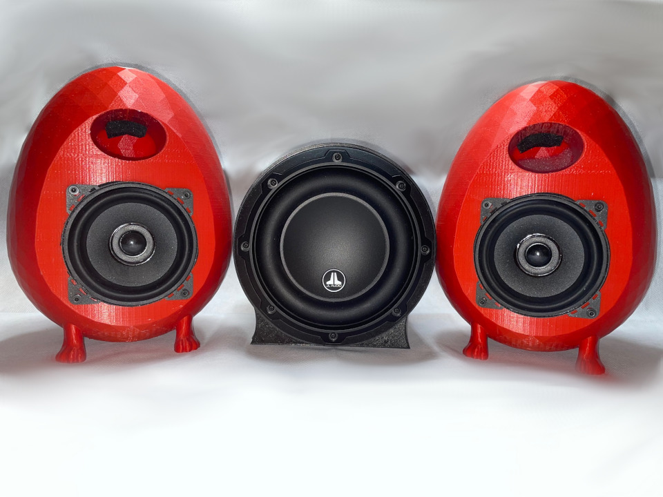

# 3D Printed 2.1 Sound for your Desktop

A while back I found it was time to upgrade the external speakers on my desktop. I'd always wanted to assemble my own setup and since I had just purchased an Ultimake 2+ Extended I finally had enough print area to make it happen. I wanted sound that could rival bookshelf systems in the $1,000 - $2,000 range. To that end, I invested around $600 in the speakers and amplifier and am super happy with the result. The system handles both music and video games very well bringing snappy bass to machine gun fire and clear deep sound to Adele's *Rolling in the Deep*.

## Key Components

| Product | Description | Cost |
|---------|-------------|------|
| [Morel Tempo Ultra 402](https://www.crutchfield.com/p_210TU402N2/Morel-Tempo-Ultra-Integra-402-MKII.html) | 4" Coaxials. 80w RMS, 80-22,000Hz, 4ohm | $289 pair |
| [JL Audio 6W3v3-4](https://www.crutchfield.com/p_1366W3V34/JL-Audio-6W3v3-4.html) | 6" Subwoofer, 150w RMS, 30-300Hz, 4ohm | $230 each |
| [Fosi TB20A](https://fosiaudio.com/products/tb20a-tpa3116d2-stereo-amplifier-2-1-channel-class-d-audio-amp-with-subwoofer-volume-control-2x50w-1x100w-sub-output-super-bass-power-receiver-treble-bass-independent-adjustment-power-supply) | 2.1 Class D Amplifier, 50w x 2, 100w x 1 | $77 each |

**Total Assembly Time:** Around 200 hours due to long print times on speaker enclosures. Assembling each speaker after printing takes 1-2 hours.

## Desktop Speaker Assembly

[Desktop Speakers](desktop-speakers.md)

## Subwoofer Assembly

[Subwoofer](subwoofer.md)
